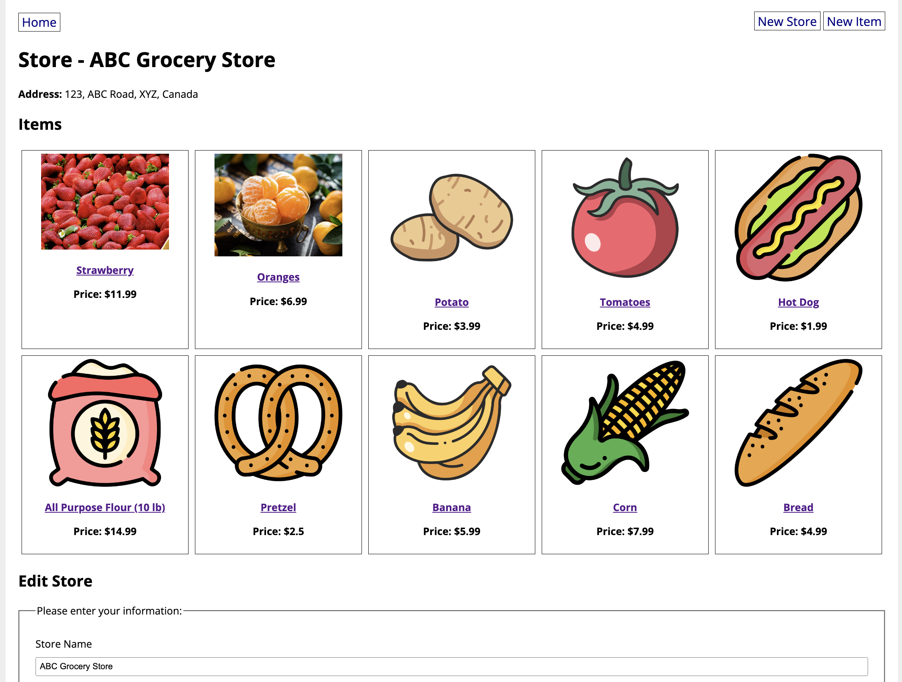

# Homework: ACS-1220-Grocery-Store
This project is built using Class-based Forms with the WTForms and Flask-WTF libraries.

To run this code, start by cloning this repository to your computer. Then in a terminal, navigate to the project folder.

To install dependencies, run:

```
pip3 install -r requirements.txt
```

Then run the server:

```
python3 app.py
```

# Site:


# Store Homepage:

