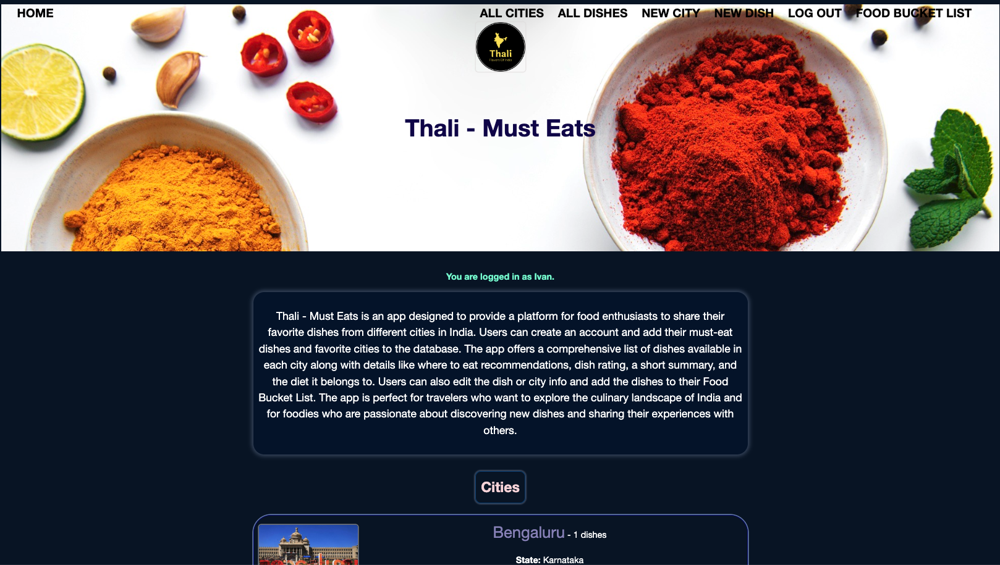
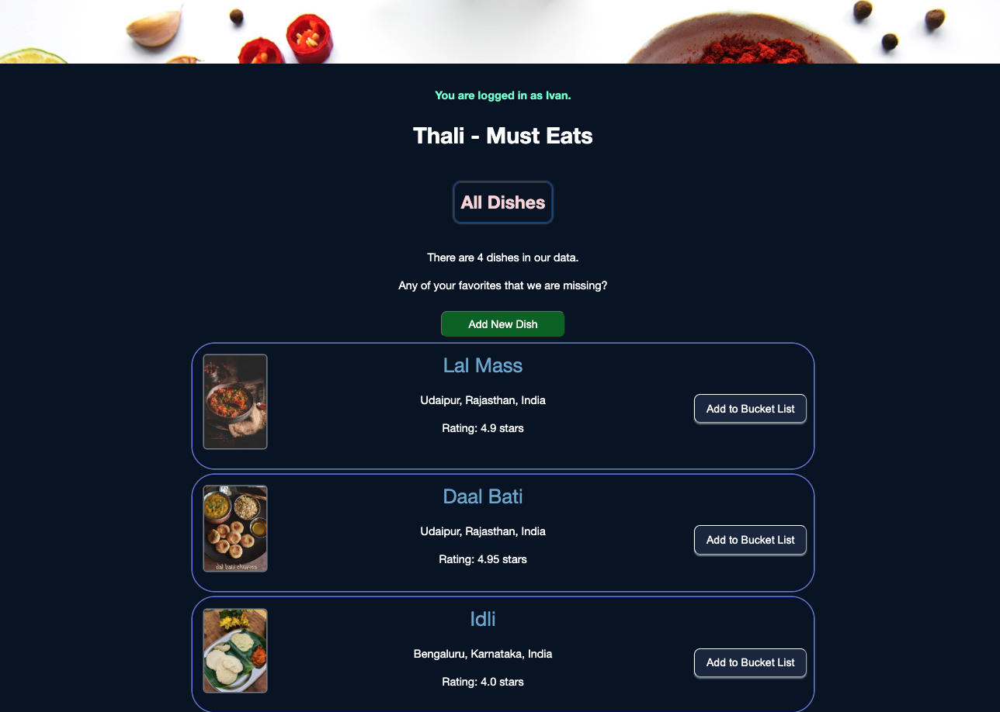
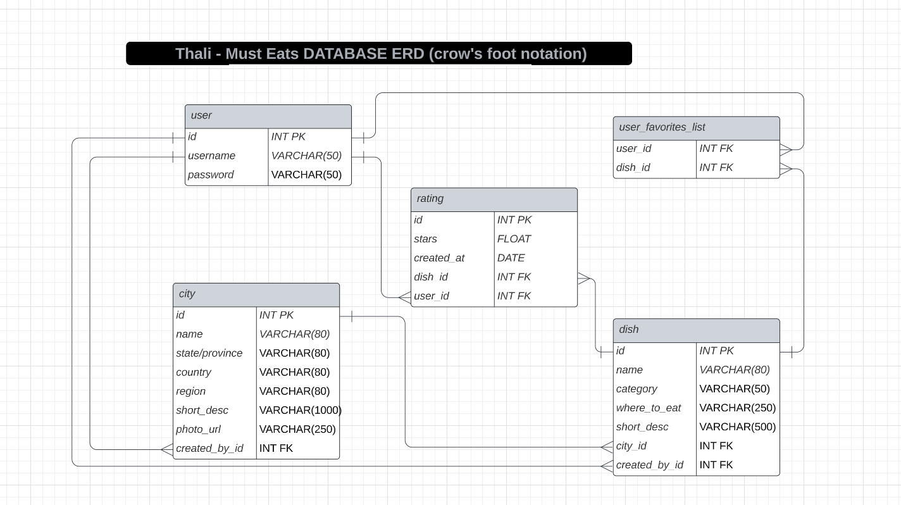

# Thali - Must Eats

Thali - Must Eats is an app designed to provide a platform for food enthusiasts to share their favorite dishes from different cities in India. Users can create an account and add their must-eat dishes and favorite cities to the database. The app offers a comprehensive list of dishes available in each city along with details like where to eat recommendations, dish rating, a short summary, and the diet it belongs to. Users can also edit the dish or city info and add the dishes to their Food Bucket List. The app is perfect for travelers who want to explore the culinary landscape of India and for foodies who are passionate about discovering new dishes and sharing their experiences with others.

This project is built using Class-based Forms with the WTForms and Flask-WTF libraries.





## Features:
- Users can create an account and add their must-eat dishes and favorite cities to the database.
- Users can also edit the dish or city info and add the dishes to their Food Bucket List.
- City Info
- List of dishes available in each city along with details like where to eat recommendations, dish rating, a short summary, and the diet it belongs to.
- Users can Rate each dish in the database. The rating for the dish is the cumulative rating by app users.

## To Run:
To run this code, start by cloning this repository to your computer. Then in a terminal, navigate to the project folder.

To install dependencies, run:

```
pip3 install -r requirements.txt
```

Then run the server:

```
python3 app.py
```

## ERD:


### The images used in the project are sourced from Google.